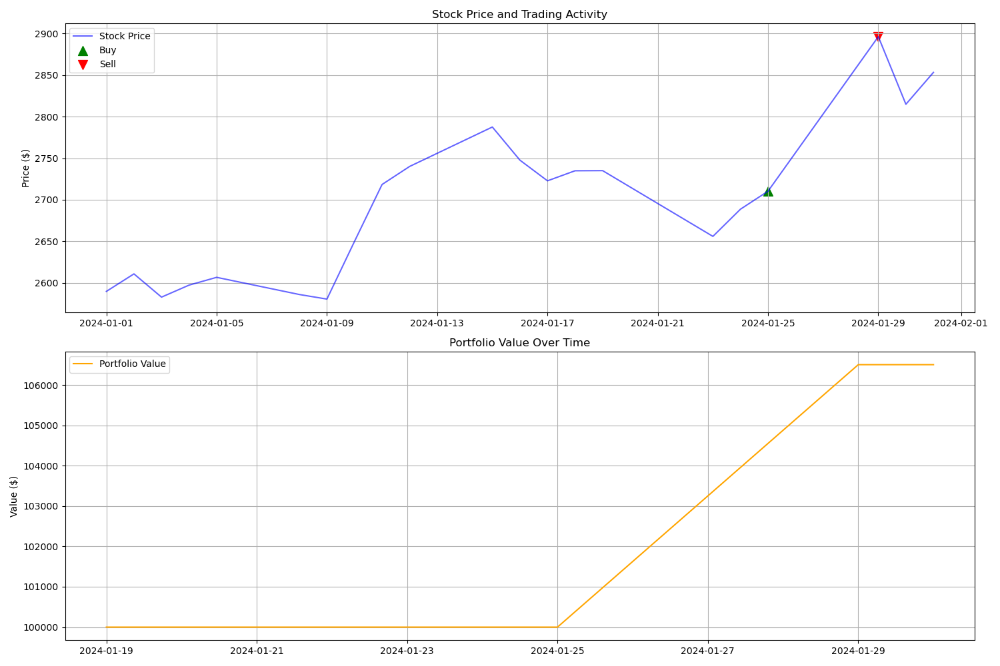

# Stock Market Prediction with Ensemble Deep Learning

A sophisticated stock market prediction system that combines CNN and LSTM models to predict stock price movements. The model has been tested on various stocks and shows promising results in backtesting.

## Features

- **Ensemble Model Architecture**: Combines CNN and Bidirectional LSTM for robust predictions
- **Real-time Predictions**: Uses Alpha Vantage API for live stock data
- **Smart Caching**: Implements efficient data caching to handle API rate limits
- **Backtesting Engine**: Complete backtesting system with visualization
- **Adaptive Trading Strategy**: Dynamic thresholds based on model confidence

## Example Results



The above plot shows a successful trade where the model:
1. Bought at ₹2,710.35 when it predicted a relatively small drop (-4.382%)
2. Sold at ₹2,896.15 when it hit the take-profit target (+6.86%)
3. Generated a total return of 6.50% in a short period

## Quick Start

1. **Clone the repository**
```bash
git clone https://github.com/yourusername/stock-market-prediction.git
cd stock-market-prediction
```

2. **Install dependencies**
```bash
pip install -r requirements.txt
```

3. **Set up your environment**
- Copy `.env.sample` to `.env`
- Get your API key from [Alpha Vantage](https://www.alphavantage.co/support/#api-key)
- Add your API key to `.env`

4. **Train the model**
```bash
python train.py
```
This will:
- Download historical data for your chosen stock
- Train the CNN and LSTM models
- Create an ensemble model
- Save the trained model in `models/ensemble_model.pth`

**Note**: Each time you run training, it will create a fresh model optimized for your chosen stock and recent market conditions. This ensures your predictions are based on up-to-date patterns.

5. **Run backtests**
```bash
python backtest.py
```

6. **Make predictions**
```bash
python main.py --symbol RELIANCE.BSE
```

## Model Architecture

The system uses an ensemble of two models:

1. **CNN Model**
- 1D Convolutions for pattern recognition
- LeakyReLU activation
- Batch normalization
- Dropout for regularization

2. **LSTM Model**
- Bidirectional LSTM for temporal patterns
- Sequence-to-one architecture
- Batch normalization
- Dropout for regularization

3. **Ensemble Combination**
- Weighted average of CNN and LSTM predictions
- Learnable weights with softmax normalization
- Small positive bias to counter bearish tendencies

## Training Tips

1. **Choose Your Stock**: The model performs best when trained on the specific stock you want to predict
2. **Data Range**: Use at least 6-12 months of historical data for training
3. **Validation**: Always check the backtesting results before using predictions
4. **Retraining**: Consider retraining periodically to adapt to changing market conditions

## Trading Strategy

The backtester implements a flexible trading strategy:
- Buy when predicted drop is less than threshold (-4.5%)
- Sell when predicted drop exceeds threshold (-6.5%)
- Stop loss at -1%
- Take profit at +1.5%

## Data Handling

- Uses Alpha Vantage API for reliable stock data
- Implements smart caching to handle rate limits
- Normalizes features using percentage changes
- Handles missing data and outliers

## Contributing

Feel free to:
- Fork the repository
- Create a feature branch
- Submit pull requests

## License

MIT License - feel free to use this for your own projects!

## Disclaimer

This is an experimental project. The predictions should not be used as financial advice. Always do your own research before making investment decisions.